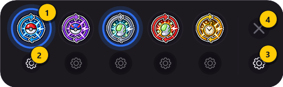
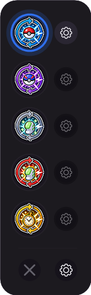
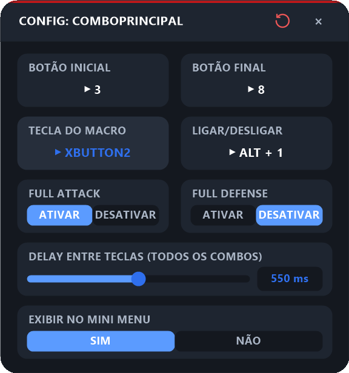
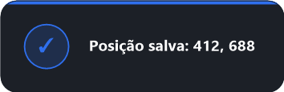
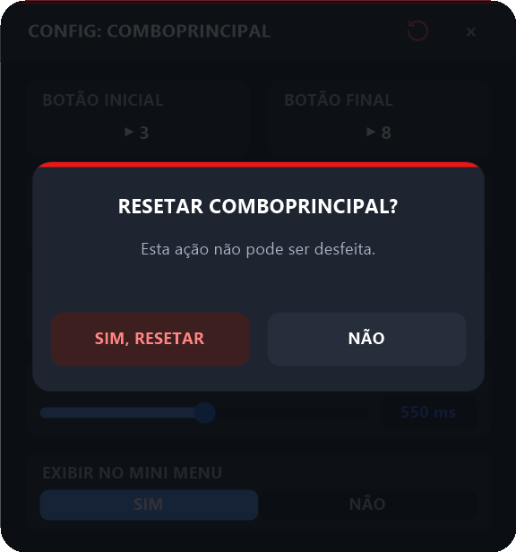

# 1. Primeiros passos — HUD, avisos e captura de teclas

[⬅ Voltar ao README](../README.md) · Próximo: [Combo Principal / Secundário ➡](02-combos.md)

Este guia mostra como abrir o PokéMacro, usar a barra flutuante (HUD) e entender os padrões que se repetem em **todas** as telas de configuração: captura de teclas, captura de posição, avisos na tela e o botão de reset.

> As imagens deste guia foram geradas a partir das próprias telas do programa, com valores de exemplo.

---

## 1.1 Iniciando o programa

1. Instale o **AutoHotkey v2.0** (não a v1.1) — <https://www.autohotkey.com/>.
2. Dê dois cliques em **`pokemacro.ahk`**.
3. A HUD aparece na tela. Se não aparecer, pressione **`Ctrl + F12`** (abre/fecha a HUD a qualquer momento).

> 💡 A HUD fica **escondida enquanto o jogo não está em foco** e reaparece sozinha quando você volta para o PokéXGames. Isso é normal.

> ⚠️ **Jogo rodando como administrador?** Se o PokéXGames estiver aberto como administrador e o macro não, o Windows bloqueia as teclas enviadas. O PokéMacro detecta isso quando o jogo entra em foco e pergunta se você quer reiniciá-lo como administrador — responda **Sim**.

---

## 1.2 A HUD (barra flutuante)

A HUD é a interface principal. Em repouso ela mostra só os ícones dos macros:

| Posição (esq. → dir.) | Macro |
|:-----:|-------|
| 1º — pokébola azul | **Combo Principal** |
| 2º — pokébola roxa | **Combo Secundário** |
| 3º — poção com aro cinza | **Reviver** |
| 4º — poção com aro vermelho | **Combo Revive** |
| 5º — relógio dourado | **Cooldown** |

### Ligar e desligar um macro

Clique no ícone. Quando o macro está **ligado**, o ícone ganha um **anel azul com brilho pulsante**:

Na imagem acima, **Combo Principal** e **Reviver** estão ligados; os outros estão desligados. Clique de novo para desligar.

> 💡 Clicar na HUD **não tira o foco do jogo** — você pode ligar/desligar macros no meio da partida.
>
> 💡 **Combo Principal, Combo Secundário e Combo Revive são exclusivos**: ligar um desliga os outros dois automaticamente.

### Botões que aparecem com o mouse sobre a barra

Passe o mouse sobre a HUD e ela revela uma segunda fileira:

| # | Elemento | O que faz |
|:-:|----------|-----------|
| **1** | Ícone do macro | Liga/desliga o macro. Com o mouse em cima aparece um tooltip com o nome do macro |
| **2** | ⚙ do macro | Abre a **tela de configuração daquele macro**. Fica apagado e acende quando o mouse passa no ícone correspondente |
| **3** | ⚙ geral | Abre as **[Configurações Gerais](06-configuracoes-gerais.md)** |
| **4** | ✕ | Fecha a HUD (reabra com `Ctrl + F12`) |

### Mover a HUD

Clique e **arraste** qualquer área vazia da barra. A posição é salva automaticamente.

### HUD na vertical

Em [Configurações Gerais → Ícones da HUD](06-configuracoes-gerais.md#passo-4--ícones-da-hud-horizontal-ou-vertical) você pode empilhar os ícones numa coluna. As engrenagens aparecem à direita de cada ícone:

---

## 1.3 Anatomia de uma tela de configuração

Todas as telas de configuração seguem o mesmo padrão. Exemplo com a tela do Combo Principal:

- **Cabeçalho**: título da tela, botão **↺** vermelho (resetar) e **×** (fechar).
- **Cartões com `▶ valor`**: clique em qualquer parte do cartão para **capturar** uma tecla ou posição (veja abaixo).
- **Pílulas** (ex.: `ATIVAR | DESATIVAR`): a opção em azul é a ativa. Clique na outra para trocar.
- **Barras deslizantes** (delays): arraste a bolinha **ou clique no número** à direita para digitar o valor — `Enter` salva, `Esc` cancela.
- **Tudo é salvo na hora** — não existe botão "Salvar". Feche com **×** quando terminar.
- A tela pode ser **arrastada** clicando em qualquer área vazia dela, e reabre no mesmo lugar da última vez.

Ao passar o mouse sobre um cartão clicável, ele clareia e o valor fica azul:

---

## 1.4 Capturando uma tecla

Sempre que clicar num cartão de tecla (ex.: **TECLA DO MACRO**):

1. Aparece um aviso no centro da tela pedindo a tecla:

   

   Nos campos de **Ligar/Desligar** e **Tecla de Pânico** você também pode usar combinações com `Ctrl`, `Alt` ou `Shift` (ex.: `Alt + 1`), e o aviso muda para:

   

2. Pressione a tecla (ou botão extra do mouse: `XButton1`, `XButton2`, `MButton`).
3. Pronto — o aviso verde confirma e o cartão já mostra a tecla nova:

   

**Outros avisos que podem aparecer:**

| Aviso | Significado |
|-------|-------------|
|  | Você apertou `Esc` — nada foi alterado |
|  | Essa tecla já pertence a outro macro/hotkey. Escolha outra (exceção: os três combos podem compartilhar a mesma **Tecla do Macro**, já que só um fica ligado por vez) |
|  | Clique esquerdo/direito não podem virar tecla de macro — eles deixariam de funcionar no jogo |

---

## 1.5 Capturando uma posição da tela

Cartões **POSIÇÃO** guardam um ponto da tela (coordenadas X, Y):

1. Deixe o jogo visível atrás da tela de configuração.
2. Clique no cartão **POSIÇÃO**. Aparece:

   

3. Clique com o **botão esquerdo** exatamente no ponto desejado do jogo.
4. A posição é salva e aparece no cartão:

   

> ⚠️ A posição é da **tela inteira**. Se você mover a janela do jogo, mudar a resolução ou o layout da interface do jogo, capture de novo.

---

## 1.6 Resetando uma tela

O botão **↺** vermelho no cabeçalho apaga **todas** as configurações daquele macro (volta tudo para `N/A`/padrão). Antes, a tela pede confirmação:

Clique em **SIM, RESETAR** para confirmar ou **NÃO** para desistir. **Não dá para desfazer.**

> O **Delay Entre Teclas** dos combos é compartilhado e **não** é apagado pelo reset de um combo.

---

## 1.7 Regras gerais de uso

- **Todas as hotkeys só funcionam com o jogo (`pxgme.exe`) em foco.** Em outra janela, suas teclas voltam ao normal.
- A **Tecla do Macro** só dispara se o macro estiver **ligado** na HUD.
- A **Hotkey Ligar/Desligar** de cada macro liga/desliga sem precisar abrir a HUD — um aviso mostra o novo estado (ex.: `COMBO PRINCIPAL: LIGADO`).
- A **[Tecla de Pânico](06-configuracoes-gerais.md#passo-5--tecla-de-pânico)** desliga todos os macros e interrompe o que estiver rodando.

---

[⬅ Voltar ao README](../README.md) · Próximo: [Combo Principal / Secundário ➡](02-combos.md)
