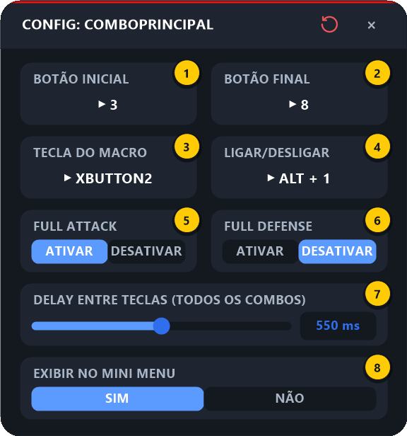

# 2. Combo Principal e Combo Secundário

[⬅ Primeiros passos](01-primeiros-passos.md) · [README](../README.md) · Próximo: [Revive ➡](03-revive.md)

Os combos apertam por você uma sequência de habilidades (ex.: `F3, F4, F5, F6, F7, F8`) com um intervalo fixo entre elas, opcionalmente com **Full Attack** antes e **Full Defense** depois.

O **Combo Principal** e o **Combo Secundário** são idênticos — são só duas configurações independentes, para você ter dois sets de habilidades (ex.: um pokémon de dano em área e outro de alvo único) e alternar entre eles clicando na HUD.

---

## 2.1 O que o combo faz, na ordem

```
[Full Attack]  →  F3  →  espera  →  F4  →  espera  →  …  →  F8  →  espera  →  [Full Defense]
 (opcional)                                                                     (opcional)
```

1. Se **Full Attack** estiver ativado, envia a tecla de Full Attack (definida nas Configurações Gerais).
2. Envia cada tecla do **Botão Inicial** até o **Botão Final**, esperando o **Delay Entre Teclas** depois de cada uma.
3. Se **Full Defense** estiver ativado, envia a tecla de Full Defense no final.

O combo **para na hora** se: você usar o **Revive** / **Combo Revive**, apertar a **Tecla de Pânico**, desligar o macro, ou sair da janela do jogo. Apertar a tecla do combo de novo enquanto ele roda **é ignorado** (não inicia um segundo combo por cima).

---

## 2.2 Configurando

Passe o mouse na HUD e clique no **⚙ abaixo do ícone do Combo Principal** (ou do Secundário):

<p align="center"></p>

| # | Campo | O que configurar |
|:-:|-------|------------------|
| **1** | **Botão Inicial** | A tecla da **primeira** habilidade do combo. Pressione `F3` ou `3` — só o número é usado |
| **2** | **Botão Final** | A tecla da **última** habilidade do combo |
| **3** | **Tecla do Macro** | A tecla/botão que **dispara** o combo no jogo (ex.: `XButton2`, botão lateral do mouse) |
| **4** | **Ligar/Desligar** | Atalho para ligar/desligar este combo sem abrir a HUD (aceita `Ctrl`/`Alt`/`Shift`, ex.: `Alt + 1`) |
| **5** | **Full Attack** | `ATIVAR` envia a tecla de Full Attack **antes** do combo |
| **6** | **Full Defense** | `ATIVAR` envia a tecla de Full Defense **depois** do combo |
| **7** | **Delay Entre Teclas** | Intervalo entre cada tecla (300 a 800 ms, padrão 550 ms). **Vale para todos os combos** |
| **8** | **Exibir no Mini Menu** | `NÃO` esconde o ícone deste combo da HUD |

### Passo a passo

1. **Botão Inicial** (1): clique no cartão e aperte a tecla da primeira habilidade (ex.: `F3`).
2. **Botão Final** (2): clique e aperte a tecla da última habilidade (ex.: `F8`).
3. **Tecla do Macro** (3): clique e aperte a tecla/botão que você vai usar para soltar o combo.
   > 💡 Botões laterais do mouse (`XButton1`/`XButton2`) são práticos: você mira com o mouse e solta o combo sem tirar a mão.
4. *(Opcional)* **Ligar/Desligar** (4): defina um atalho, ex.: `Alt + 1`.
5. *(Opcional)* **Full Attack / Full Defense** (5 e 6): primeiro defina as teclas em [Configurações Gerais](07-configuracoes-gerais.md#passo-6--teclas-de-full-attack-e-full-defense); depois clique em `ATIVAR` aqui.
6. **Delay** (7): comece com o padrão (550 ms). Se habilidades estiverem "falhando", aumente; se estiver sobrando tempo, diminua.
7. Feche a tela no **×**.

> ⚠️ **Prefixo F:** o combo envia `F3…F8` ou `3…8` conforme a opção **[Prefixo [F]](07-configuracoes-gerais.md#passo-1--prefixo-f)** das Configurações Gerais. Confira se bate com as teclas das suas habilidades no jogo.

---

## 2.3 Usando no jogo

1. Na HUD, clique no ícone do **Combo Principal** — ele ganha o anel azul (ligado).

   <p align="center"></p>

2. Clique na janela do jogo (ele precisa estar em foco).
3. Aperte a **Tecla do Macro** — o combo roda sozinho.
4. Para trocar para o Combo Secundário, é só clicar no ícone dele: o Principal desliga automaticamente (os combos são exclusivos).

### Exemplo com os valores da imagem

| Configuração | Valor |
|--------------|-------|
| Botão Inicial / Final | `3` / `8` |
| Prefixo [F] | `SIM (F1..F9)` |
| Full Attack | Ativado (tecla `F10`) |
| Full Defense | Desativado |
| Delay | 550 ms |
| Tecla do Macro | `XButton2` |

Ao apertar `XButton2` no jogo: `F10` → `F3` → 550 ms → `F4` → 550 ms → … → `F8`.

---

## 2.4 Problemas comuns

| Sintoma | Solução |
|---------|---------|
| Nada acontece | O ícone está com anel azul? O jogo está em foco? Botão Inicial/Final e Tecla do Macro não estão `N/A`? |
| Algumas habilidades não saem | Aumente o **Delay Entre Teclas** (o jogo pode estar recusando teclas muito rápidas) |
| Sai a tecla errada (`3` em vez de `F3`) | Ajuste o **Prefixo [F]** nas Configurações Gerais |
| O combo parou no meio | Algo o interrompeu: Revive, Pânico, macro desligado ou você trocou de janela |

---

[⬅ Primeiros passos](01-primeiros-passos.md) · [README](../README.md) · Próximo: [Revive ➡](03-revive.md)
