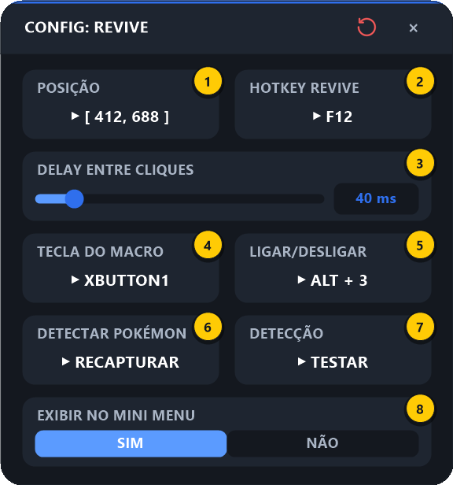

# 3. Revive

[⬅ Combos](02-combos.md) · [README](../README.md) · Próximo: [Combo Revive ➡](04-combo-revive.md)

O Revive faz, com um único botão, toda a sequência de reviver o pokémon: recolhe o pokémon, usa o item de revive nele e o solta de novo — e devolve o mouse para onde estava.

---

## 3.1 O que o revive faz, na ordem

1. Move o mouse para a **Posição** configurada.
2. **Recolhe** o pokémon (`Ctrl + 1`, ou clique direito no [Modo Legado](06-configuracoes-gerais.md#passo-2--modo-legado)).
   - Com a **detecção do pokémon** calibrada (veja 3.4), esse passo é **pulado** se o pokémon já estiver guardado ou morto — evita que a sequência saia invertida.
3. Espera o **Delay entre Cliques**.
4. Aperta a **Hotkey Revive** (a tecla do item de revive no jogo).
5. **Solta** o pokémon de novo (`Ctrl + 1` ou clique direito).
6. Devolve o mouse para a posição original.

> 💡 Usar o Revive **no meio de um combo interrompe o combo** na hora e revive.

---

## 3.2 Configurando

Passe o mouse na HUD e clique no **⚙ abaixo do ícone do Reviver**:

| # | Campo | O que configurar |
|:-:|-------|------------------|
| **1** | **Posição** | Ponto da tela onde o mouse vai durante o revive — clique sobre o pokémon que será revivido |
| **2** | **Hotkey Revive** | A tecla do jogo que usa o item de revive |
| **3** | **Delay entre Cliques** | Espera entre recolher o pokémon e usar o item (0 a 300 ms, padrão 50 ms) |
| **4** | **Tecla do Macro** | A tecla/botão que dispara o revive (ex.: `XButton1`) |
| **5** | **Ligar/Desligar** | Atalho para ligar/desligar o Revive sem abrir a HUD |
| **6** | **Detectar Pokémon** | Captura o ícone do "dedo" da barra de habilidades (veja 3.4). Mostra `CAPTURAR DEDO` antes da primeira captura e `RECAPTURAR` depois |
| **7** | **Detecção** | `INATIVA` enquanto não houver captura; depois vira `TESTAR`, que mostra se o pokémon está fora agora |
| **8** | **Exibir no Mini Menu** | `NÃO` esconde o ícone do Reviver da HUD |

### Passo a passo

1. Deixe o jogo aberto e visível atrás da tela de configuração.
2. **Posição** (1): clique no cartão e, em seguida, clique com o botão esquerdo **sobre o pokémon** que você quer reviver.

   

3. **Hotkey Revive** (2): clique no cartão e aperte a tecla em que o item de revive está no jogo.
4. **Tecla do Macro** (4): clique e aperte o botão que vai disparar o revive.
   > 💡 Um botão lateral do mouse (`XButton1`) funciona muito bem aqui.
5. **Delay** (3): deixe o padrão. Só aumente se o item estiver sendo usado antes do pokémon voltar para a pokébola.
6. *(Recomendado)* Calibre a **detecção do pokémon** — seção 3.4.
7. Feche no **×**.

---

## 3.3 Usando no jogo

1. Na HUD, clique no ícone do **Reviver** para ligá-lo (anel azul).
2. Com o jogo em foco, aperte a **Tecla do Macro** quando quiser reviver.

Se a posição não estiver definida, aparece:

---

## 3.4 Detecção do pokémon (ícone do dedo)

**Por que usar:** sem a detecção, o revive sempre começa recolhendo o pokémon. Se ele **já estava guardado ou morto**, esse primeiro `Ctrl + 1` o **solta** em vez de recolher, e a sequência inteira sai invertida.

**Como funciona:** com o pokémon fora da pokébola, o jogo mostra a barra de habilidades, que tem um **ícone de dedo apontando** na ponta. Com o pokémon guardado/morto, a barra some. O macro procura esse ícone na janela do jogo antes de cada revive — mesmo se você mover ou redimensionar a barra.

### Calibrando (uma vez só)

1. No jogo, **solte o pokémon** (ele precisa estar **fora** da pokébola, com a barra de habilidades visível).
2. Na tela do Revive, clique em **DETECTAR POKÉMON → CAPTURAR DEDO** (6). Aparece:

   

3. Clique **no centro do ícone do dedo** na barra de habilidades do jogo.
4. Em seguida aparece o aviso abaixo — **afaste o mouse** do ícone (o macro espera o mouse sair de cima para não capturar o efeito de hover do jogo):

   

5. Se deu certo:

   

   O cartão passa a mostrar **RECAPTURAR** e o botão ao lado vira **TESTAR**.

### Testando

Clique em **DETECÇÃO → TESTAR** (7):

| Situação no jogo | Resultado esperado |
|------------------|--------------------|
| Pokémon **fora** |  |
| Pokémon **guardado ou morto** |  |

Se o resultado estiver errado, clique em **RECAPTURAR** e repita a calibração com o pokémon fora.

**Mensagens de erro na captura:**

- *"Pouco contraste — clique bem no centro do dedo"* / *"Ícone não reconhecido"* → você clicou fora do ícone. Tente de novo, bem no meio do dedo.
- *"Capturado, mas não reconhecido na tela"* → a imagem foi salva, mas não foi achada na janela do jogo. Confira se o jogo está aberto e recapture.

> 💡 Para **desligar a detecção**, use o **↺ (reset)** da tela do Revive — ele apaga também o ícone capturado. Sem calibração, o revive volta ao comportamento antigo (sempre recolhe primeiro).

---

## 3.5 Problemas comuns

| Sintoma | Solução |
|---------|---------|
| O pokémon é solto em vez de recolhido | Calibre a **detecção do pokémon** (3.4) |
| O item é usado mas o pokémon não revive | Recapture a **Posição** exatamente sobre o pokémon; aumente o **Delay** |
| Nada acontece | Revive ligado na HUD? Jogo em foco? Tecla do Macro definida? |
| Funciona às vezes, às vezes não | Teste o **Modo Legado** nas [Configurações Gerais](06-configuracoes-gerais.md#passo-2--modo-legado) |

---

[⬅ Combos](02-combos.md) · [README](../README.md) · Próximo: [Combo Revive ➡](04-combo-revive.md)
