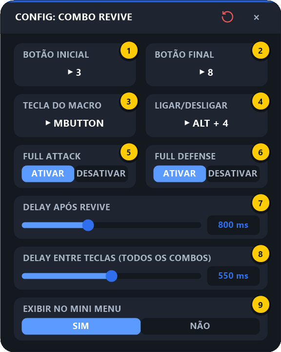

# 4. Combo Revive

[⬅ Revive](03-revive.md) · [README](../README.md) · Próximo: [Cooldown ➡](05-cooldown.md)

O Combo Revive junta os dois: **revive o pokémon e, logo em seguida, solta um combo de habilidades** — tudo com um botão. Ideal para voltar ao combate imediatamente depois de reviver.

> ⚠️ **Configure o [Revive](03-revive.md) primeiro.** O Combo Revive usa a **Posição**, a **Hotkey Revive**, o **Delay entre Cliques** e a **detecção do pokémon** da tela do Revive. Esta tela só configura a parte do combo.

---

## 4.1 O que ele faz, na ordem

```
[Revive completo]  →  Delay Após Revive  →  [Full Attack]  →  F3 … F8  →  [Full Defense]
 (config. do Revive)                          (opcional)                    (opcional)
```

1. Executa o revive completo, exatamente como o macro [Revive](03-revive.md#31-o-que-o-revive-faz-na-ordem).
2. Espera o **Delay Após Revive** (tempo do pokémon voltar ao campo).
3. Executa o combo, com as mesmas regras do [Combo Principal](02-combos.md#21-o-que-o-combo-faz-na-ordem).

> 💡 O Combo Revive é **exclusivo** com os Combos Principal e Secundário: ligar um desliga os outros. Ele pode usar a mesma **Tecla do Macro** que eles.

---

## 4.2 Configurando

Passe o mouse na HUD e clique no **⚙ abaixo do ícone do Combo Revive**:

<p align="center"></p>

| # | Campo | O que configurar |
|:-:|-------|------------------|
| **1** | **Botão Inicial** | Primeira habilidade do combo depois do revive |
| **2** | **Botão Final** | Última habilidade do combo |
| **3** | **Tecla do Macro** | A tecla/botão que dispara o Combo Revive inteiro |
| **4** | **Ligar/Desligar** | Atalho para ligar/desligar o Combo Revive sem abrir a HUD |
| **5** | **Full Attack** | `ATIVAR` envia Full Attack antes do combo |
| **6** | **Full Defense** | `ATIVAR` envia Full Defense depois do combo |
| **7** | **Delay Após Revive** | Espera entre o fim do revive e a primeira habilidade (100 a 2000 ms, padrão 500 ms) |
| **8** | **Delay Entre Teclas** | Intervalo entre as habilidades — **o mesmo valor de todos os combos** |
| **9** | **Exibir no Mini Menu** | `NÃO` esconde o ícone do Combo Revive da HUD |

### Passo a passo

1. Confirme que o **[Revive](03-revive.md#32-configurando)** já está configurado (pelo menos a **Posição**).
2. **Botão Inicial / Final** (1 e 2): clique em cada um e aperte a primeira e a última habilidade.
3. **Tecla do Macro** (3): o botão que vai disparar tudo.
4. **Delay Após Revive** (7): comece com 500–800 ms. Se a primeira habilidade sair antes do pokémon estar em campo, aumente (1000 ms ou mais).
5. *(Opcional)* Full Attack / Full Defense (5 e 6) e atalho de Ligar/Desligar (4).
6. Feche no **×**.

---

## 4.3 Usando no jogo

1. Na HUD, clique no ícone do **Combo Revive** (4º ícone) para ligá-lo.
2. Com o jogo em foco, aperte a **Tecla do Macro**: o pokémon é revivido e o combo começa sozinho.

Se a posição do Revive não estiver definida, aparece o aviso *"COMBO REVIVE: Defina a posição do Revive primeiro!"*.

> 💡 O Combo Revive também **interrompe** um combo que esteja rodando, assim como o Revive.

---

## 4.4 Problemas comuns

| Sintoma | Solução |
|---------|---------|
| Revive funciona mas o combo não sai | Aumente o **Delay Após Revive**; confira Botão Inicial/Final |
| O revive sai invertido | Calibre a [detecção do pokémon](03-revive.md#34-detecção-do-pokémon-ícone-do-dedo) na tela do Revive |
| Nada acontece | Combo Revive ligado na HUD? Jogo em foco? Tecla do Macro definida? |

---

[⬅ Revive](03-revive.md) · [README](../README.md) · Próximo: [Cooldown ➡](05-cooldown.md)
