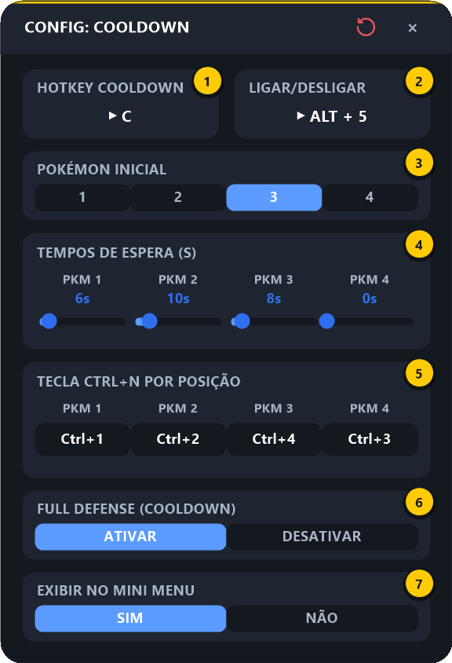
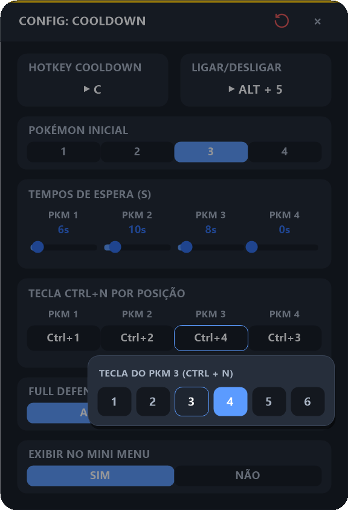

# 5. Cooldown

[⬅ Combo Revive](04-combo-revive.md) · [README](../README.md) · Próximo: [Rotação ➡](06-rotacao.md)

O Cooldown faz uma **rotação de pokémons**: chama um pokémon com `Ctrl + N`, espera um tempo, chama o próximo, e assim por diante, da posição que você escolher **até a posição 1**. Útil para girar o time enquanto as habilidades de cada um recarregam.

---

## 5.1 O que ele faz, na ordem

Com **Pokémon Inicial = 3** (valores da imagem abaixo):

```
[Full Defense]  →  Ctrl+4 (PKM 3)  →  8 s  →  Ctrl+2 (PKM 2)  →  10 s  →  Ctrl+1 (PKM 1)  →  6 s  →  fim
  (opcional)
```

1. Se **Full Defense** estiver ativado, envia a tecla de Full Defense.
2. Para cada posição, do **Pokémon Inicial** até a **1**:
   - envia `Ctrl + N`, onde **N** é a tecla configurada para aquela posição;
   - espera o **tempo** configurado para aquela posição.
3. Termina.

- Apertar a **Hotkey Cooldown** de novo enquanto roda **cancela** a rotação (aparece `CANCELADO`).
- Se você sair do jogo durante a espera, o macro **traz a janela do jogo de volta** antes de enviar a próxima tecla. Se o jogo for fechado, a rotação é cancelada.

---

## 5.2 Configurando

Passe o mouse na HUD e clique no **⚙ abaixo do ícone do Cooldown**:

<p align="center"></p>

| # | Campo | O que configurar |
|:-:|-------|------------------|
| **1** | **Hotkey Cooldown** | A tecla que **inicia** (e cancela) a rotação |
| **2** | **Ligar/Desligar** | Atalho para ligar/desligar o Cooldown sem abrir a HUD |
| **3** | **Pokémon Inicial** | De qual posição (1 a 4) a rotação começa — ela sempre desce até a 1 |
| **4** | **Tempos de Espera** | Quantos segundos (0 a 60) esperar **depois** de chamar cada posição |
| **5** | **Tecla Ctrl+N por Posição** | Qual número vai junto com `Ctrl` em cada posição. Clicar no botão abre um seletor com `1` a `6` |
| **6** | **Full Defense (Cooldown)** | `ATIVAR` envia Full Defense antes de começar a rotação |
| **7** | **Exibir no Mini Menu** | `NÃO` esconde o ícone do Cooldown da HUD |

### Passo a passo

1. **Hotkey Cooldown** (1): clique no cartão e aperte a tecla que vai iniciar a rotação.
2. **Pokémon Inicial** (3): clique no número da posição onde a rotação começa.
3. **Tempos de Espera** (4): para cada posição usada, arraste a barrinha **ou clique no número** (ex.: `8s`) para digitar — `Enter` salva, `Esc` cancela.
4. **Tecla Ctrl+N** (5): clique no botão de cada posição — abre, logo abaixo dele, um seletor com os números `1` a `6` (o atual destacado em azul). Clique no número certo; clicar fora ou `Esc` fecha sem mudar nada.

   <p align="center"></p>

   > **Para que serve:** por padrão, a posição 1 envia `Ctrl+1`, a 2 envia `Ctrl+2` etc. Se no seu time a ordem for diferente, ajuste aqui. Na imagem, a posição 3 envia `Ctrl+4` e a posição 4 envia `Ctrl+3`.
5. *(Opcional)* **Full Defense** (6) — defina a tecla antes em [Configurações Gerais](07-configuracoes-gerais.md#passo-6--teclas-de-full-attack-e-full-defense).
6. Feche no **×**.

---

## 5.3 Usando no jogo

1. Na HUD, clique no ícone do **Cooldown** (5º, relógio) para ligá-lo.
2. Com o jogo em foco, aperte a **Hotkey Cooldown** — a rotação começa.
3. Para parar antes do fim, aperte a **Hotkey Cooldown** de novo (ou a [Tecla de Pânico](07-configuracoes-gerais.md#passo-5--tecla-de-pânico)).

> 💡 O Cooldown pode ser iniciado/cancelado mesmo durante um combo.

---

## 5.4 Problemas comuns

| Sintoma | Solução |
|---------|---------|
| Chama o pokémon errado | Ajuste a **Tecla Ctrl+N** de cada posição |
| Termina cedo demais / pula posição | Confira o **Pokémon Inicial** e os **Tempos**; um tempo de `0s` passa direto para a próxima posição |
| Nada acontece | Cooldown ligado na HUD? Jogo em foco? Hotkey Cooldown definida? |

---

[⬅ Combo Revive](04-combo-revive.md) · [README](../README.md) · Próximo: [Rotação ➡](06-rotacao.md)
