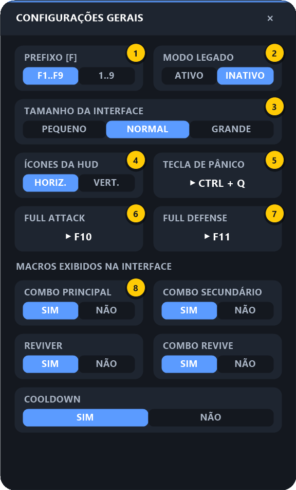

# 6. Configurações Gerais

[⬅ Cooldown](05-cooldown.md) · [README](../README.md) · Início: [Primeiros passos](01-primeiros-passos.md)

Opções **globais**, que valem para todos os macros. Para abrir: passe o mouse na HUD e clique no **⚙ geral** (o da direita, abaixo do **✕**).

| # | Opção | Resumo |
|:-:|-------|--------|
| **1** | Prefixo [F] | Combos enviam `F3, F4…` ou `3, 4…` |
| **2** | Modo Legado | Revive usa clique direito em vez de `Ctrl + 1` |
| **3** | Tamanho da Interface | Pequeno / Normal / Grande (HUD e telas) |
| **4** | Ícones da HUD | Barra horizontal ou vertical |
| **5** | Tecla de Pânico | Desliga tudo de uma vez |
| **6** | Full Attack | Tecla de Full Attack usada pelos combos |
| **7** | Full Defense | Tecla de Full Defense usada pelos combos e pelo Cooldown |
| **8** | Macros exibidos na interface | Mostra/esconde cada ícone da HUD |

---

### Passo 1 — Prefixo [F]

Define como os combos enviam as teclas das habilidades:

| Opção | Botão Inicial `3`, Final `6` envia | Use quando |
|-------|-----------------------------------|-----------|
| **F1..F9** (padrão) | `F3, F4, F5, F6` | Suas habilidades estão nas teclas F |
| **1..9** | `3, 4, 5, 6` | Suas habilidades estão nos números |

### Passo 2 — Modo Legado

Muda como o [Revive](03-revive.md) e o [Combo Revive](04-combo-revive.md) recolhem/soltam o pokémon:

| Opção | Comportamento |
|-------|---------------|
| **INATIVO** (padrão) | Usa `Ctrl + 1` |
| **ATIVO** | Usa **clique direito** na posição configurada |

Deixe **INATIVO**, a menos que o revive não funcione no seu cliente do jogo.

### Passo 3 — Tamanho da Interface

`PEQUENO`, `NORMAL` ou `GRANDE`. Muda o tamanho da HUD e de todas as telas de configuração na hora.

### Passo 4 — Ícones da HUD (horizontal ou vertical)

| HORIZ. (padrão) | VERT. |
|:---:|:---:|
|  |  |

### Passo 5 — Tecla de Pânico

Clique no cartão e aperte uma tecla ou combinação (ex.: `Ctrl + Q`). Com o jogo em foco, ela:

- **desliga todos os macros**;
- **interrompe** o combo ou a rotação de Cooldown que estiver rodando;
- mostra o aviso *"TODOS OS MACROS DESLIGADOS"*.

> 💡 Configure uma! É o jeito mais rápido de parar tudo se algo sair do controle.

### Passo 6 — Teclas de Full Attack e Full Defense

Clique em **FULL ATTACK** (6) e aperte a tecla de Full Attack do jogo; faça o mesmo em **FULL DEFENSE** (7).

Essas teclas são **definidas uma vez aqui** e cada macro decide se usa ou não:

| Macro | Onde ativar |
|-------|-------------|
| Combo Principal / Secundário | Pílulas **Full Attack** / **Full Defense** na [tela do combo](02-combos.md#22-configurando) |
| Combo Revive | Pílulas **Full Attack** / **Full Defense** na [tela do Combo Revive](04-combo-revive.md#42-configurando) |
| Cooldown | Pílula **Full Defense (Cooldown)** na [tela do Cooldown](05-cooldown.md#52-configurando) |

### Passo 7 — Macros exibidos na interface

Um cartão `SIM | NÃO` para cada macro. Com `NÃO`, o ícone some da HUD — útil para esconder macros que você não usa. É a mesma opção **Exibir no Mini Menu** que existe em cada tela de macro.

---

[⬅ Cooldown](05-cooldown.md) · [README](../README.md) · Início: [Primeiros passos](01-primeiros-passos.md)
