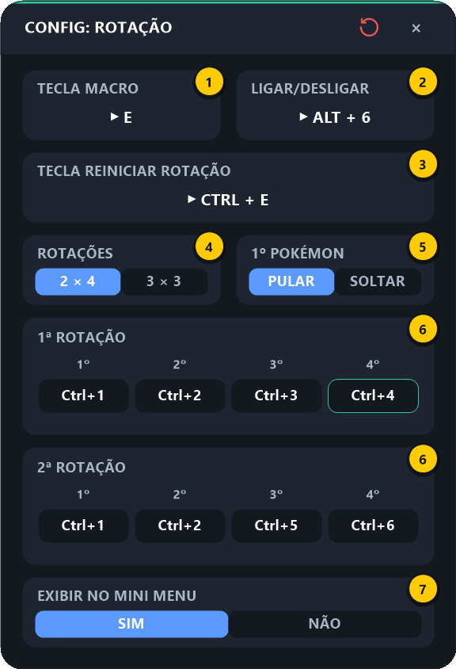
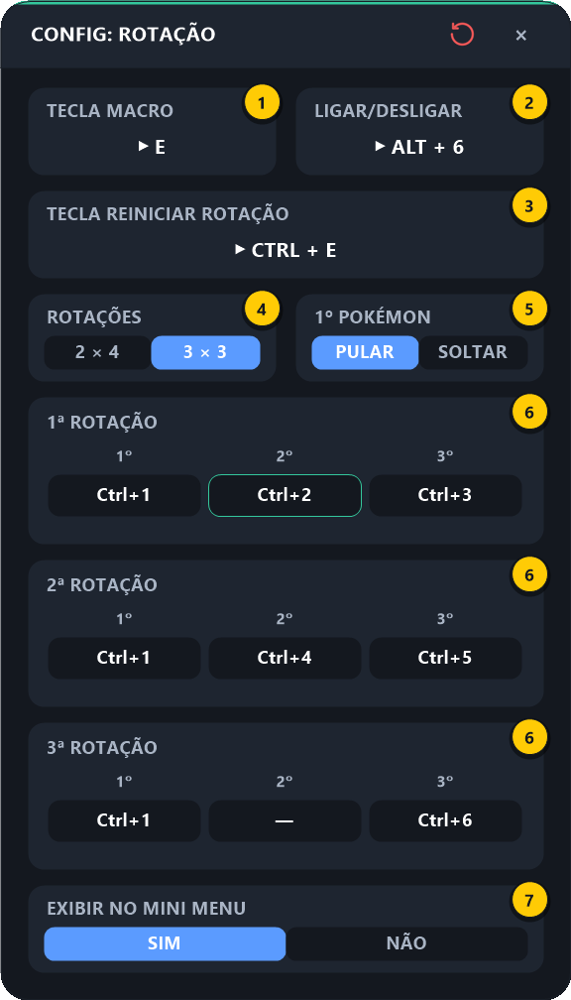
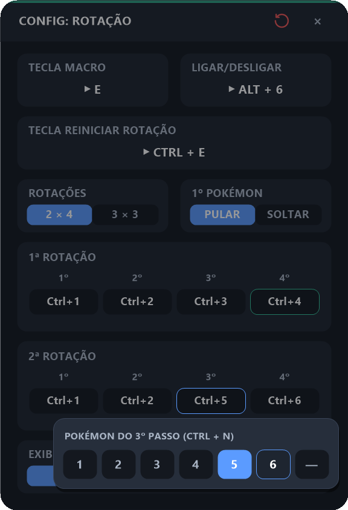

# 6. Rotação

[⬅ Cooldown](05-cooldown.md) · [README](../README.md) · Próximo: [Configurações Gerais ➡](07-configuracoes-gerais.md)

A Rotação troca de pokémon com **uma tecla só**: cada vez que você aperta a **Tecla Macro**, ela envia o `Ctrl + N` do pokémon da vez e já passa para o próximo da ordem que você salvou. A HUD mostra, no próprio ícone, **qual `Ctrl + N` sai no próximo aperto**.

---

## 6.1 O que ele faz, na ordem

A ordem é uma rotação depois da outra e, no fim da última, volta ao começo. Há dois **formatos**:

| Formato | Para quando | Padrão |
|---------|-------------|--------|
| **2 × 4** — 2 rotações de 4 pokémons | Começo do jogo | `1-2-3-4` · `1-2-5-6` |
| **3 × 3** — 3 rotações de 3 pokémons | Mais para frente, com o time mais forte | `1-2-3` · `1-4-5` · `1-—-6` |

Cada formato guarda a **sua própria** configuração: trocar de 2 × 4 para 3 × 3 e voltar não perde nada.

- **Cada aperto envia um `Ctrl + N` só** — não há espera nem sequência automática; quem decide a hora de trocar é você.
- **Cada aperto também para o combo que estiver rodando** (Combo Principal, Secundário ou Combo Revive). Assim as skills que faltavam — e o Full Defense — não saem no pokémon que acabou de entrar.
- Um passo **vazio (`—`)** é pulado. Ex.: no 2 × 4, deixando o 4º passo da 2ª rotação vazio, a ordem vira `1-2-3-4 | 1-2-5` e volta para o começo.
- **Ligar a Rotação** (na HUD ou pelo atalho) sempre começa do início.
- **O 1º pokémon de cada rotação fica com você (padrão).** Com a opção **1º Pokémon** em `PULAR`, o macro **nunca envia o 1º passo de nenhuma rotação**: você puxa esse pokémon à mão no começo de cada rotação, e o macro só chama do 2º em diante. Para o macro enviar o 1º passo também, mude a opção para `SOLTAR`.
- A posição atual fica só na memória: ao reiniciar o programa, a rotação recomeça do início.

Com o padrão (`PULAR`), os apertos da Tecla Macro enviam:

```
2 × 4:  (1 à mão) 2 → 3 → 4   (1 à mão) 2 → 5 → 6   → volta para o 2
3 × 3:  (1 à mão) 2 → 3   (1 à mão) 4 → 5   (1 à mão) 6   → volta para o 2
```

### A 3ª rotação do 3 × 3 (pokémon repetido)

Na 3ª rotação do 3 × 3 é comum **repetir um pokémon** antes do último. Para isso serve o **2º passo da 3ª rotação**:

- **Vazio (`—`, padrão):** depois do 1º pokémon, o macro vai **direto para o 3º** (`Ctrl+6`).
- **Com um `Ctrl + N`:** o macro solta esse pokémon repetido e só então o 3º. Ex.: com `Ctrl+4` ali, a 3ª rotação fica `(1 à mão) 4 → 6`.

É o mesmo `—` de qualquer outro passo: clique no botão e escolha `—` para desativar, ou o número desejado para ativar.

---

## 6.2 Configurando

Passe o mouse na HUD e clique no **⚙ abaixo do ícone da Rotação** (o 6º, duas pokébolas com setas verdes):

| 2 × 4 | 3 × 3 |
|:---:|:---:|
|  |  |

| # | Campo | O que configurar |
|:-:|-------|------------------|
| **1** | **Tecla Macro** | A tecla que envia o próximo pokémon da rotação |
| **2** | **Ligar/Desligar** | Atalho para ligar/desligar a Rotação sem abrir a HUD |
| **3** | **Tecla Reiniciar Rotação** | Atalho que volta a rotação para o **início** (só funciona com a Rotação ligada) |
| **4** | **Rotações** | Formato: `2 × 4` (2 rotações de 4 pokémons) ou `3 × 3` (3 rotações de 3). A tela se ajusta na hora, com um cartão por rotação |
| **5** | **1º Pokémon** | `PULAR` (padrão): o macro nunca envia o 1º passo das rotações — você puxa esse pokémon à mão. `SOLTAR`: o 1º passo sai normalmente |
| **6** | **Rotações (cartões)** | Um cartão por rotação, com um botão por passo. Clicar num passo abre o seletor para escolher o pokémon (`1` a `6`) ou `—` (vazio) |
| **7** | **Exibir no Mini Menu** | `NÃO` esconde o ícone da Rotação da HUD |

O passo que sai no próximo aperto aparece com contorno verde (nas imagens, o `Ctrl+4` da 1ª rotação no 2 × 4 e o `Ctrl+2` no 3 × 3).

### Passo a passo

1. **Tecla Macro** (1): clique no cartão e aperte a tecla que vai trocar de pokémon.
2. **Rotações** (4): escolha `2 × 4` ou `3 × 3`.
3. **Cartões das rotações** (6): clique no botão de um passo — abre, logo abaixo dele, um seletor com as opções `1` a `6` (o `N` do `Ctrl + N`) e `—` (vazio), com a atual destacada em azul. Clique na opção desejada. Clicar fora do seletor ou apertar `Esc` fecha sem mudar nada. Use `—` para pular um passo (ex.: o pokémon repetido da 3ª rotação no 3 × 3).

   <p align="center"></p>

   > Mexer em qualquer passo (ou nas opções 4 e 5) **reinicia** a rotação.
4. **1º Pokémon** (5): deixe em `PULAR` se você puxa o 1º pokémon à mão no começo de cada rotação (o normal). Escolha `SOLTAR` se quiser que o macro chame ele também.
5. *(Opcional)* **Tecla Reiniciar Rotação** (3): útil se, no meio da luta, a ordem real dos pokémons sair do compasso da HUD.
6. Feche no **×**.

---

## 6.3 Usando no jogo

1. Na HUD, clique no ícone da **Rotação** (6º) para ligá-la — o anel fica azul, o ícone escurece e aparece por cima o número do **próximo** `Ctrl + N`:

   <p align="center"></p>

   Na imagem, a Rotação acabou de ser ligada com o padrão (1º pokémon puxado à mão) e o ícone mostra **2**: o próximo aperto envia `Ctrl+2`.
2. Com o jogo em foco, aperte a **Tecla Macro** para soltar o pokémon da vez. O número do ícone muda na hora. Se um combo estiver rodando, ele **para** antes da troca.
3. Saiu do compasso? Aperte a **Tecla Reiniciar Rotação** — aparece o aviso:

   <p align="center"></p>

> 💡 A Rotação funciona mesmo durante um combo — e **interrompe o combo**, para as skills restantes não saírem no pokémon novo.
>
> 💡 Com a Rotação **desligada**, o ícone volta ao normal (sem número), e a Tecla Macro volta a chegar normalmente ao jogo.

---

## 6.4 Problemas comuns

| Sintoma | Solução |
|---------|---------|
| Soltou o pokémon errado | Confira o **formato** (4) e os passos das rotações (6); use a **Tecla Reiniciar Rotação** para voltar ao início |
| No 3 × 3, não soltou o pokémon repetido da 3ª rotação | O 2º passo da 3ª rotação está `—` (padrão); escolha um `Ctrl + N` nele |
| O macro nunca envia o 1º pokémon das rotações | É o padrão (`PULAR`); mude **1º Pokémon** (5) para `SOLTAR` |
| Aviso *"ROTAÇÃO: nenhum pokémon configurado"* | Todos os passos estão `—`; escolha pelo menos um `Ctrl + N` |
| Nada acontece | Rotação ligada na HUD? Jogo em foco? Tecla Macro definida? |

---

[⬅ Cooldown](05-cooldown.md) · [README](../README.md) · Próximo: [Configurações Gerais ➡](07-configuracoes-gerais.md)
